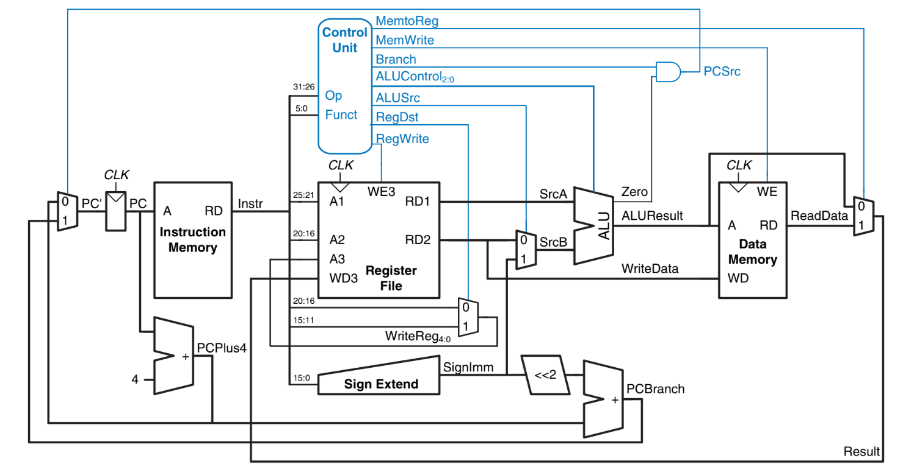
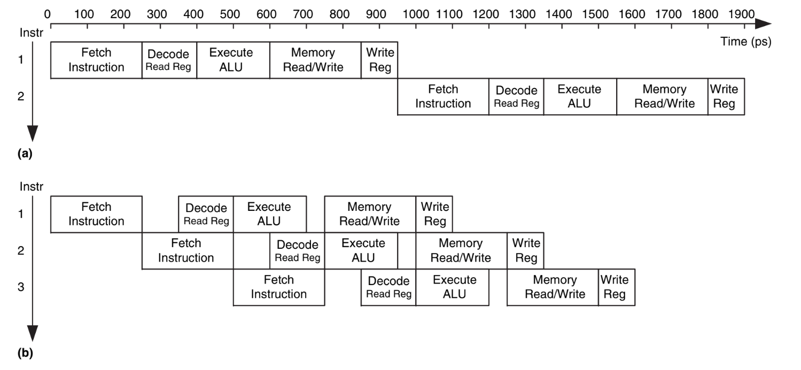
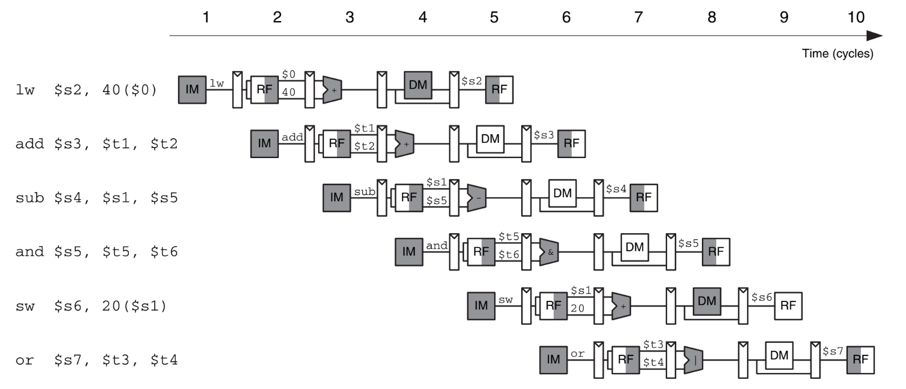
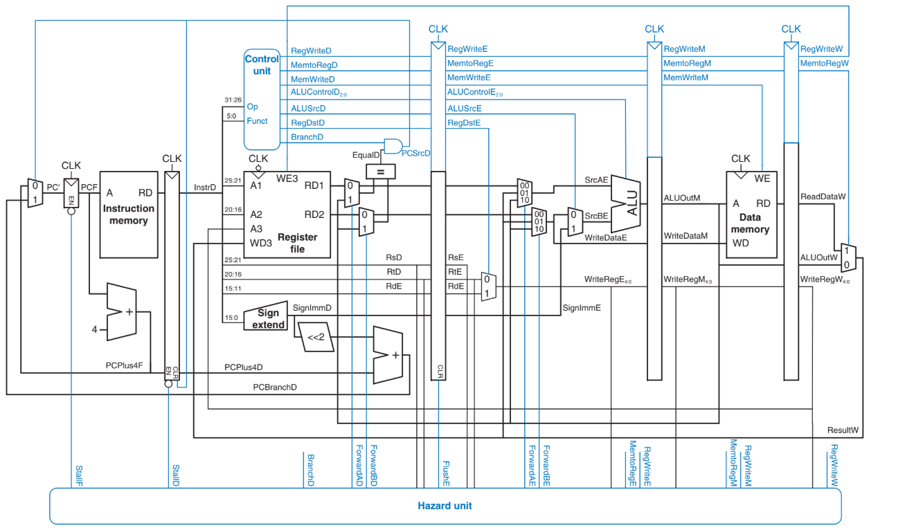

# MIPS-Processor-Design

### File structure

```
├── src/ # Processor design files
│ ├── ALU.sv
│ ├── ControlUnit.sv
│ ├── DataPath.sv
│ └── ...
├── tb/ # Testbench files
│ ├── ALU_tb.sv
│ ├── ControlUnit_tb.sv
│ └── ...
├── asm/ # Assembly test programs
│ ├── add_test.asm
│ ├── branch_test.asm
│ └── ...
├── tools/ # Utility scripts or tools
│ ├── assembler.py
│ ├── waveform_viewer_settings.json
│ └── ...
└── docs/ # Documentation
├── architecture_diagram.png
├── pipeline_explanation.md
└── ...
```

## Processor Design

### Single Cycle MIPS Processor


- ALU Encoding table

| **ALUop** | **Meaning**     |
|-----------|-----------------|
| 00        | add             |
| 01        | subtract        |
| 10        | look at funct field |
| 11        | n/a             |

--- 
### Timing diagram between Single cycle and Pipelined Processor



---

### Pipeline operation



---

### Pipelined processor block diagram




